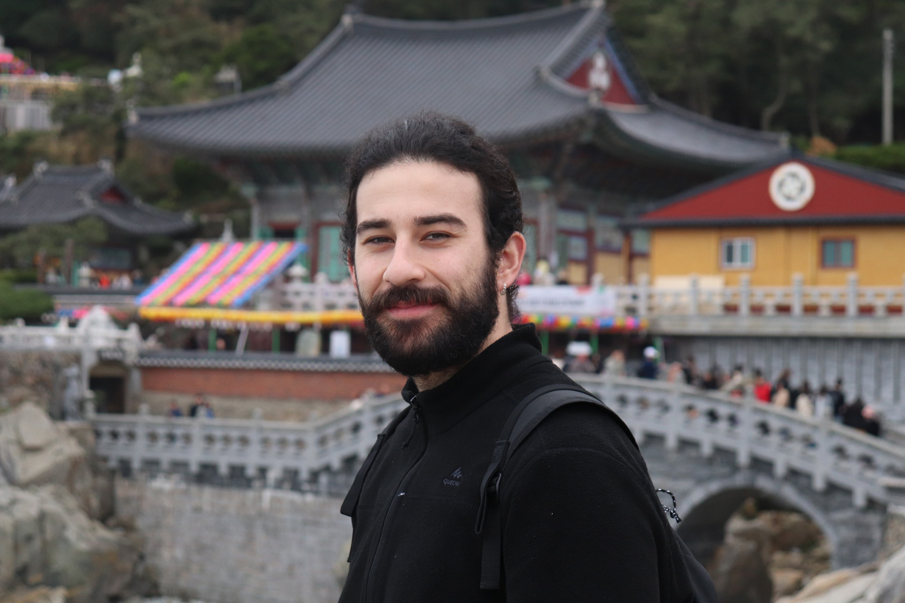

> photo by Myrto

I am currently a Postdoc at the Faculty of Mathematics, Informatics and Mechanics of the University of Warsaw, as part of the ERC project [BUKA](https://sites.google.com/view/buka-project/) led by [Szymon Toruńczyk](https://www.mimuw.edu.pl/~szymtor/).

Previously, I received my Ph.D. working on (algorithmic) structural graph theory under the supervision of [Christophe Paul](https://www.lirmm.fr/~paul/) and [Dimitrios M. Thilikos](https://www.lirmm.fr/~thilikosto/).

I am generally interested in algorithmic and structural dichotomy theorems based on they duality of graph parameters and their universal obstructions with respect to quasi-ordering relations on graphs.
