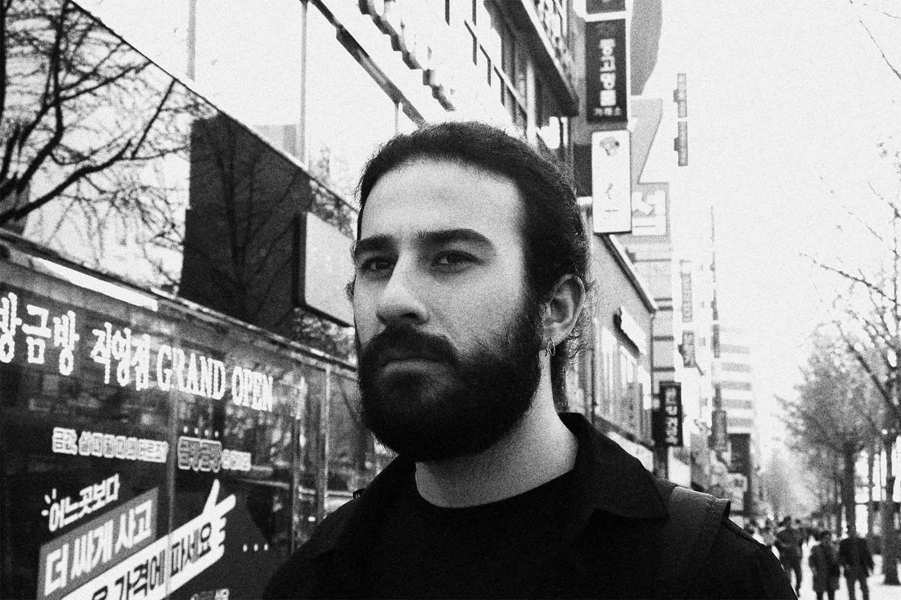

> photo by Myrto

I received my Ph.D. working on (algorithmic) structural graph theory under the supervision of [Christophe Paul](https://www.lirmm.fr/~paul/) and [Dimitrios M. Thilikos](https://www.lirmm.fr/~thilikosto/).

I am currently interested in algorithmic and structural dichotomy theorems based on they duality of graph parameters and their universal obstructions with respect to quasi-ordering relations on graphs.
